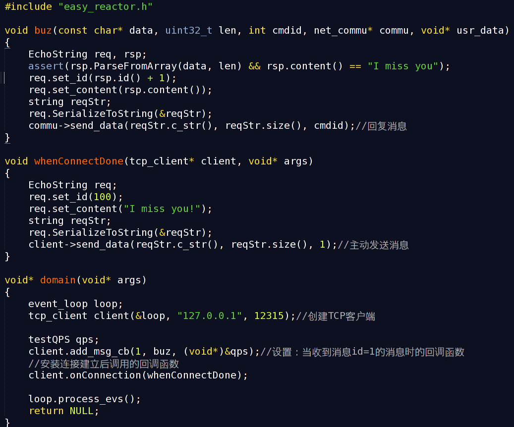

# Easy Reactor

Easy-Reactor是一个基于Reactor模式的Linux C++网络服务器框架，支持多线程TCP服务器，单线程TCP服务器，单线程UDP服务器等形式，可以让使用者完全专注于业务，快速开发出一个高效的服务器应用。

在工作中开发基础服务器的经验总结、以及阅读陈硕《muduo》一书的收获，使得我以沉淀的心态做了这个项目

此项目在我的另一个项目[易用稳定、高性能的服务间远程调用管理、调度、负载系统：Easy-Load-Balancer][1]中得到了全面应用，此项目的实战充分证明了Easy-Reactor服务框架的**性能很高、使用也很简单**

[1]: https://github.com/LeechanX/Easy-Load-Balancer

#### 性能一览

>服务器参数：
>CPU个数：24   内存：128GB   网卡队列个数：24
>
>测试程序：
>echo pingpong服务，每次传递100字节内容，见目录test/

| TCP服务线程数 |  benchmark情况 |  QPS |
| :-----: | :-----: | :-----: |
|1线程|5个benchmark，各建立100个连接| `10.96W/s` |
|3线程|5个benchmark，各建立100个连接| `31.06W/s` |
|5线程|5个benchmark，各建立100个连接| `48.12W/s` |
|8线程|9个benchmark，各建立100个连接| `59.79W/s` |

## 介绍

### IO Event: 基于epoll

一切IO事件设置为非阻塞，由Linux epoll进行管理，且TCP、UDP的可读、可写事件均以默认方式即水平模式注册

为什么不用EPOLLET边缘触发模式？见我的文章：[边缘模式的写事件（神坑！）][2]

[2]: http://ec18ca33.wiz03.com/share/s/3I6cEP3LBkz72L4E1Y1Wmgi51eyPsS1W-4r625pXha0VtIjQ

### Timer Event: Timer Queue设计

- 以最小堆管理Timers（注册Timer、删除Timer），以每个Timer的发生时间在最小堆中排序
- 以timerfd作为通知方式，交给eventLoop监听，将超时事件转为IO事件
- timerfd所设置的时间总是最小堆的堆顶Timer的发生时间

### EventLoop

IO Event与Timer Event全部在EventLoop中注册、监听、运行，一个EventLoop独占一个线程

### TCP服务器架构：多线程Reactor

多线程TCP服务器采用了one loop per thread模型（memcached、muduo也是这么干的）

主线程作为Accepter角色，线程池作为实际连接操作者TCPConnection，线程池每个线程运行EventLoop维护一定量的连接，管理这些连接的IO Event与Timer Event，线程池中每个线程初始时监听自己队列的eventfd，便于与主线程通信

#### Accepter细节
1. Accepter收到新连接，以Round-Robin轮询方法将连接发送到一个线程的队列，以交给此线程管理这个连接
2. Accepter已达连接上限时，使用占坑法处理
3. Accepter使用大数组管理所有连接信息，当一个连接关闭，并不立即清理TCPConnection对象，而是等待新连接到来后复用此对象（memcached也是这么干的）

#### 可写事件与busy loop
由于TCP socket写缓冲区总是准备好的（除非满了），如果一直监听EPOLLOUT事件会造成EventLoop产生busy loop现象，最严重会吃满CPU
故：
- 有数据要写时，才监听EPOLLOUT；
- 当所有数据已写到socket，立刻删除EPOLLOUT事件

#### 粘包处理
使用固定长度包头8字节（4字节存放消息类型，4字节存放消息body长度），任何在Easy-Reactor中发送的消息都会被默默加上这个包头

#### 消息分发
Server对象提供了：不同消息类型注册不同的回调函数功能，方便用户可以根据不同消息类型编写不同的处理函数
当读取socket数据后，如果包完整，则会根据消息类型ID，将一条 **完整的消息** 发给对应的回调函数去处理

#### 缓冲区管理
每个连接对象TCPConnection没必要一直持有着读缓冲区和写缓冲区：
预设我们需要的一个缓冲区大小64KB，则每个连接需要读、写缓冲区共128KB -> 当连接数变多，内存占用过大

实际上
- 对于读缓冲区，当读完全部数据且被处理后，读缓冲区就可以释放了，除非有粘包发生
- 对于写缓冲区，当全部数据被发送到socket，写缓冲区就可以释放了，除非有数据没发完

我设计了一个简单的缓冲区管理容器，预先分配各种大小的缓冲区若干：
4K缓冲区：5000个，16KB：1000个，64KB：500个，256KB：200个，1MB：50个，4MB：10个

而每个TCPConnection初始时是没有读写缓冲区的，当需要读写时就向管理器索要一个长度合适的缓冲区使用，使用完就归还。具体而言：

##### 每当TCPconnection读取数据：
- 先会利用`fcntl+FIONREAD`获取可读数据大小
- 如果有读缓冲区（说明上次粘包了，没归还），则看剩余缓冲区空间是否放得下新数据，能就放，不能就跟管理器要个新缓冲区替代了旧的，copy了旧缓冲区的数据后把旧的归还，把新可读数据放进来
- 如果没有读缓冲区（说明上次没粘包，归还了），则跟管理器要个缓冲区，把新可读数据放进来
- 当业务回调处理后发现缓冲区没更多数据了，归还；否则，将剩余数据移动到缓冲区头部，继续持有等待下次使用

##### 每当TCPconnection写数据：
- 用户调用sendData，如果有写缓冲区（说明上次每写完，不归还），则追加数据，如果放不下了，就跟管理器要个新缓冲区替代了旧的，copy了旧缓冲区的数据后把旧的归还，把新待发数据放进来
- 一次性把写缓冲区的数据发送给socket后，如果发送完成，则归还缓冲区；否则把剩余待发数据移动到缓冲区头部，继续持有等待下次使用

### UDP服务器架构：单线程Reactor

由于UDP是无连接的，多线程操作同一个UDP socket效率未必很高，故选择了单线程模型，图略因为很简单

使用者完全可以使用多线程，每个线程运行Easy-Reactor UDP服务器，即每个线程一个地址不同的UDP socket，可得到一定的并行能力

### TCP、UDP客户端

都是eventLoop方式

### 使用方法

以一个TCP的`pingpong echo server`为例（具体TCP、UDP、timer例子见example目录）

#### tcp server端：

#### tcp client端：

